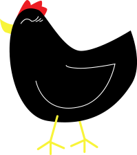

### Egg Catch!
a SplatJS game tutorial by Alex Bezuska

## Before we get started:
#[LMG Codepen signup](https://docs.google.com/forms/d/1PLbxnpzasREP0YvWKkCPQcf-4G1P_VUwmxE0YB9Vk-E/viewform)

### [Try the finished game](http://louisvillemakesgames.org/education/projects/candycatch/)

#Our starting point:
[Egg Catch starter](http://codepen.io/AlexBezuska/pen/KzYozg)

#assets

###Background

http://louisvillemakesgames.org/education/content/background.png

###Chicken

http://louisvillemakesgames.org/education/content/chicken.png

###Eggs

http://louisvillemakesgames.org/education/content/egg-brown.png

http://louisvillemakesgames.org/education/content/egg-blue.png

http://louisvillemakesgames.org/education/content/egg-white.png

http://louisvillemakesgames.org/education/content/egg-green.png

#Resources
[SplatJS Documentation](http://splatjs.com/)

###### Create your own pixel art and save it using these online tools:
http://pixieengine.com/

###### Upload your own assets using this simple image host:
http://postimage.org/

###### New local non-profit to promote gamedev education & careers:
[Louisville Makes Games!](http://www.louisvillemakesgames.org)

###### Get involved in the Louisville Game Developer Community
[GameDevLou](http://www.gamedevlou.org)

###### Learn more about programming!
[Sign up for a free Treehouse account though the Louisville Public Library!](http://www.lfpl.org/treehouse/)

http://www.codecademy.com/

###### Contact Alex with any questions you might have:
[alex@twoscoopgames.com](mailto:alex@twoscoopgames.com)
